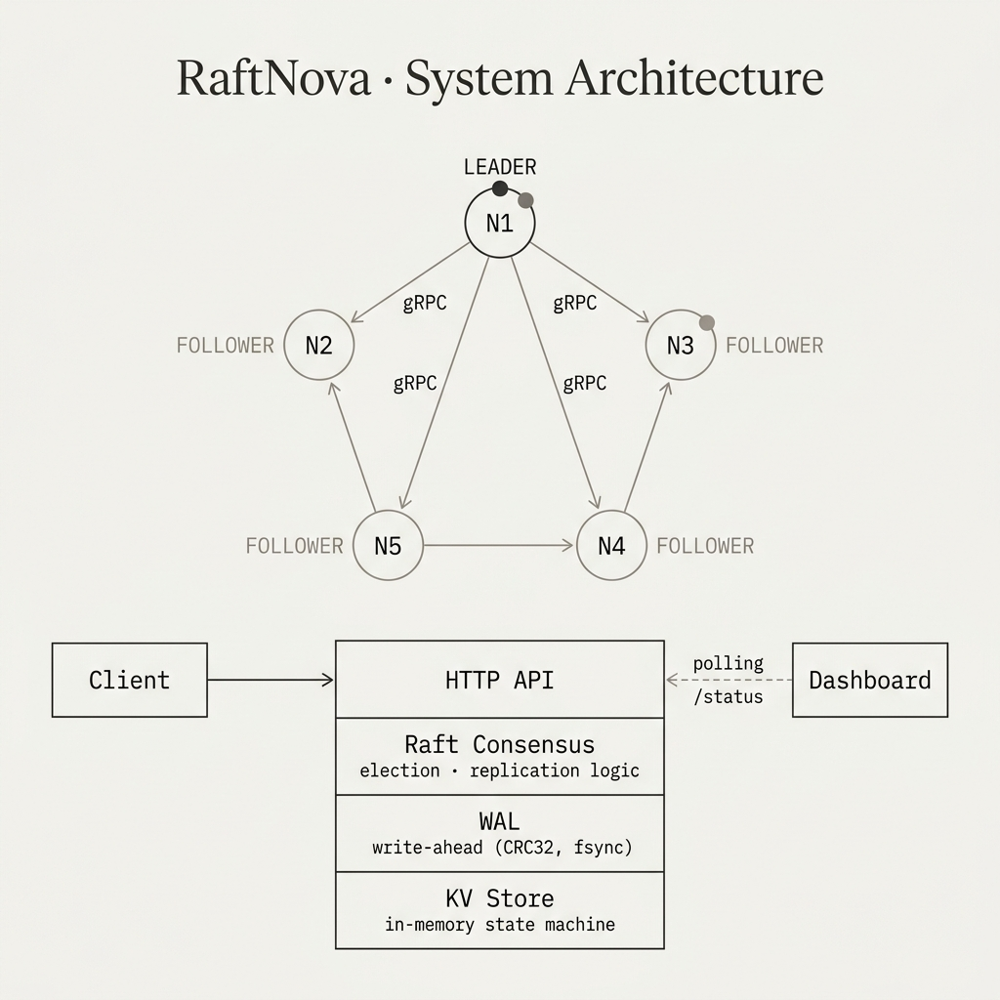
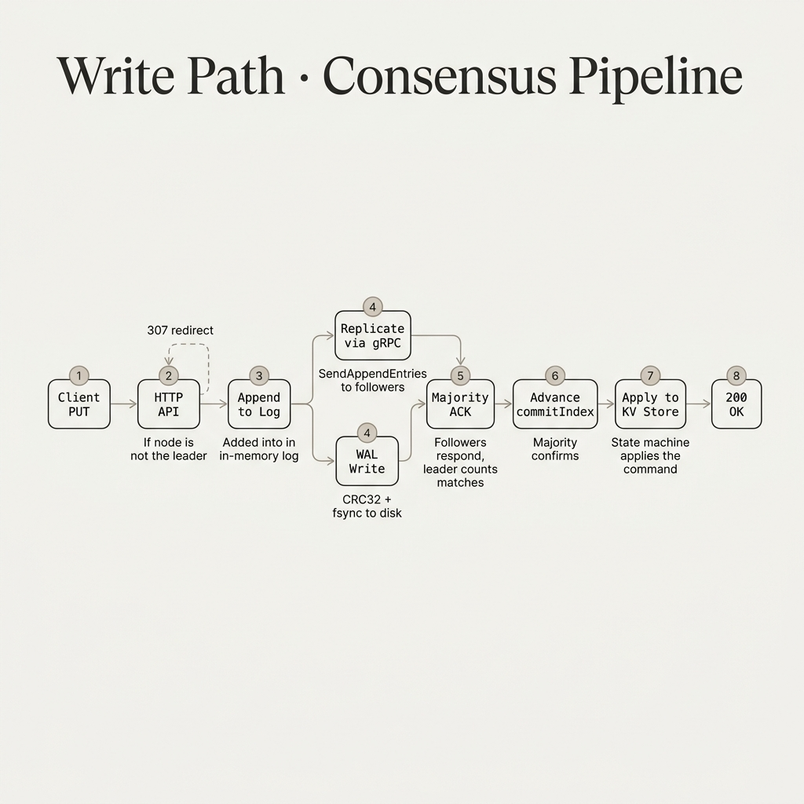
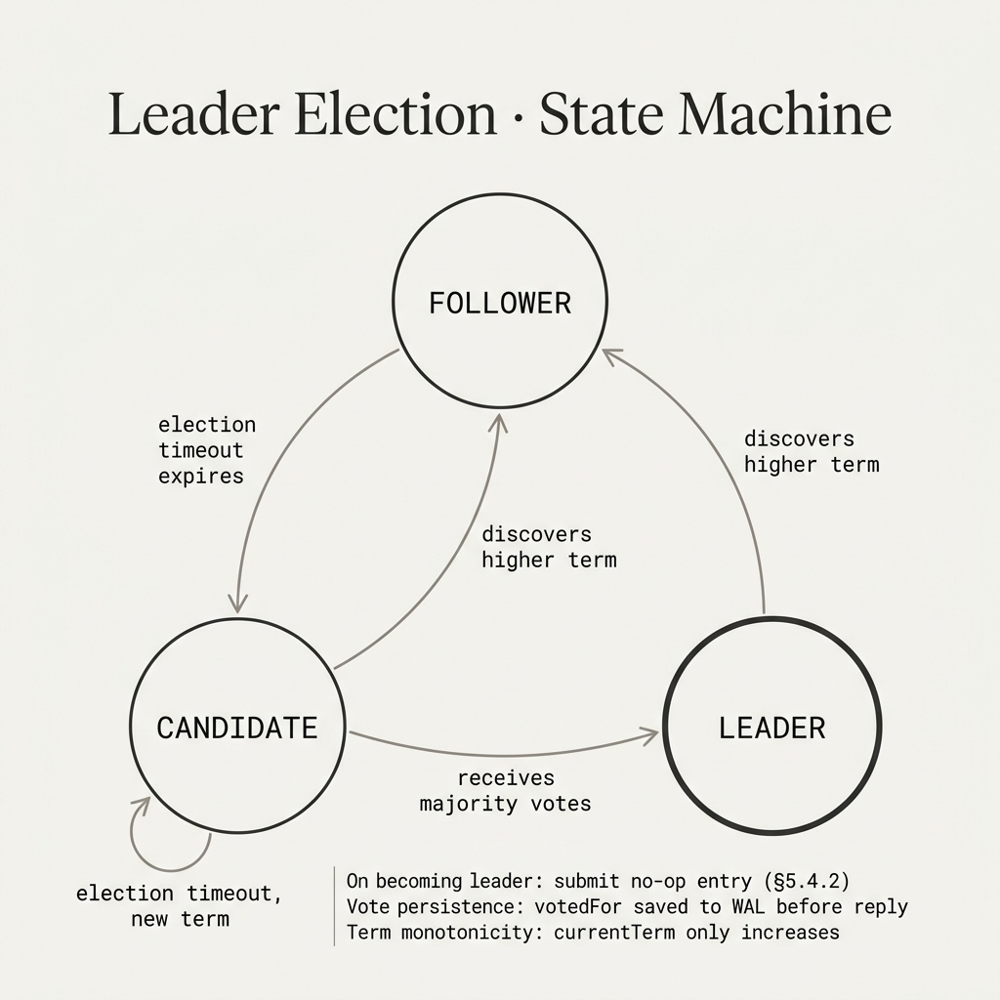
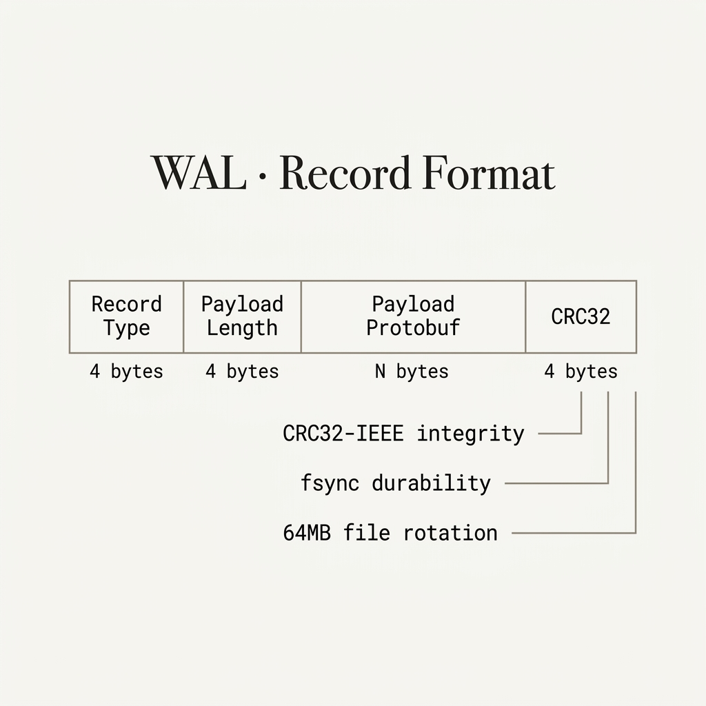

# RaftNova

A crash-consistent distributed key-value store implementing the Raft consensus algorithm from scratch in Go. Full paper compliance — Figure 8 safety, WAL persistence with CRC32 integrity, pipelined replication, and chaos-tested correctness.

---

## System Architecture

<p align="center">
  
</p>

RaftNova runs as a 5-node cluster. Each node contains four layers: an HTTP API for client access, the Raft consensus engine for election and replication, a Write-Ahead Log for crash-safe persistence, and an in-memory KV store as the replicated state machine. Nodes communicate over gRPC for leader election and log replication.

| Component | File | Responsibility |
|---|---|---|
| **Raft Consensus** | `internal/raft/node.go` | State machine — election, replication, commit |
| **Log** | `internal/raft/log.go` | 1-indexed in-memory log with truncation |
| **Replication** | `internal/raft/replication.go` | Pipelined follower sync, commitIndex advance |
| **WAL** | `internal/storage/wal.go` | Append-only persistence — CRC32, fsync, rotation |
| **gRPC Transport** | `internal/transport/grpc.go` | Lazy-connect, connection pooling |
| **HTTP API** | `internal/api/http.go` | REST endpoints, leader redirect, health probes |
| **KV Store** | `internal/kvstore/store.go` | `map[string]string` state machine with `Apply()` |
| **Dashboard** | `dashboard/` | React 19 + D3 live cluster visualization |

---

## Write Path

<p align="center">
  
</p>

Every write follows this pipeline:
1. **Client PUT** — HTTP request to any node
2. **HTTP API** — Non-leaders return `307 Redirect` to the leader
3. **Append to Log** — Entry added to the leader's in-memory log
4. **Parallel fork** — WAL write (CRC32 + fsync) and gRPC replication to followers happen concurrently
5. **Majority ACK** — Leader waits for a majority of followers to acknowledge
6. **Advance commitIndex** — Only when the entry's term matches the current term (Figure 8)
7. **Apply to KV Store** — Asynchronous apply loop processes committed entries
8. **200 OK** — Response to client

The WAL write and network replication are pipelined (etcd-style) — the leader does not block on disk before sending to followers. This is what enables ~7,400 ops/sec under concurrent load.

---

## Leader Election

<p align="center">
  
</p>

Every node starts as a **Follower**. If it receives no heartbeat within its randomized election timeout (150–300ms), it becomes a **Candidate**, increments its term, and requests votes from all peers. If it receives a majority, it becomes the **Leader** and immediately submits a no-op entry (§5.4.2) to commit pending entries from prior terms.

Any node discovering a higher term in any RPC immediately steps down to Follower — this is the single mechanism that prevents split-brain.

---

## WAL Record Format

<p align="center">
  
</p>

Every entry is persisted before acknowledgment. The WAL uses a binary format with CRC32-IEEE integrity checking over the full header + payload. On replay after a crash, records with invalid CRC are truncated — the log self-heals to the last consistent point.

- **Payload encoding:** Protocol Buffers
- **Integrity:** CRC32-IEEE computed over record type + length + payload
- **Durability:** `fsync()` after every write — no acknowledged data can be lost
- **Rotation:** Files rotate at 64 MB (`wal-000001.log`, `wal-000002.log`, ...)
- **Batch optimization:** `AppendMany()` amortizes a single fsync across multiple entries

---

## Correctness Invariants

These are enforced in code with inline comments at the enforcement site:

1. **`currentTerm` only increases** — Monotonically increasing term ensures stale leaders step down.
2. **`votedFor` persisted before any vote reply** — Prevents double-voting after crash recovery.
3. **Committed entries never deleted** — Log truncation only removes entries beyond commitIndex.
4. **Leader only commits entries from its own term** — The Figure 8 safety rule.

---

## Why This Problem Is Hard

**Split votes.** When multiple followers timeout at the same instant, they all become candidates and split the vote. Raft solves this with randomized election timeouts (150–300ms), but getting the distribution right matters — too tight and you get correlated timeouts, too wide and failover is slow.

**Leader crash mid-commit.** A leader accepts a write, persists it to its own WAL, replicates it to one follower, then crashes. The entry is on 2/5 nodes. Is it committed? No — but the client might have received an ack. Raft's answer: the entry isn't committed until a majority has it, and only the leader decides when commitIndex advances. But there's a subtlety — Figure 8.

**Log divergence after partition.** Node-1 is partitioned from the rest. It accepts writes that never replicate. Meanwhile, the majority elects a new leader and makes progress. When the partition heals, node-1 has entries that conflict with the true log. Raft handles this through the AppendEntries consistency check — the leader probes backward using fast conflict rollback, then overwrites the divergent suffix.

---

## Real Bugs Hit and Fixed

### Bug 1: Election timer not resetting on AppendEntries
**Symptom:** Under load, followers would timeout and start elections even while receiving valid heartbeats. Cluster entered repeated election cycles.
**Root cause:** AppendEntries handler processed entries but forgot to call `resetElectionTimer()`. The timer fired even on valid heartbeat receipt.
**Fix:** One line. But finding it took two hours because the symptom (split votes) looked like a vote-counting bug.

### Bug 2: Double-counting votes
**Symptom:** A node believed it had majority with only 2 actual votes.
**Root cause:** A peer responded to RequestVote twice (retry + delayed original). Vote counter incremented both times.
**Fix:** Added `votesReceived map[NodeID]bool`. Only count first response per peer.

### Bug 3: WAL replay not restoring votedFor
**Symptom:** After crash and restart, a node voted for two candidates in the same term — violating election safety.
**Root cause:** WAL replay reconstructed `currentTerm` but skipped `votedFor`. Node restarted as if it had never voted.
**Fix:** Restore both term and votedFor atomically during WAL replay.

### Bug 4: commitIndex advance without term check (Figure 8)
**Symptom:** Stale reads after leader change. A key written under term 3 returned an old value after term 4.
**Root cause:** Leader was committing entries from previous terms by counting matchIndex majority — violating Figure 8.
**Fix:** In `advanceCommitIndex()`: `if log.TermAt(idx) != currentTerm { continue }`. Only commit entries from the current term.

### Bug 5: nextIndex initialization causing missed entries
**Symptom:** Keys written and acked by the old leader were absent after new leader election.
**Root cause:** New leader initialized `nextIndex[peer] = lastLogIndex + 1` using its own log length, which was shorter than some followers. Their extra entries were incorrectly truncated.
**Fix:** Truncation logic only applies to *conflicting* entries, not extra valid ones.

---

## Performance

```text
Benchmark: concurrent writes, 100-byte values, full pipelining
3-node cluster:   ~7,400 ops/sec
```

*Sequential workloads (no pipelining):*
- 3-node cluster: ~1,200 ops/sec (P50: 2.1ms, P99: 8.4ms)
- 5-node cluster: ~900 ops/sec (P50: 2.8ms, P99: 11.2ms)

The latency floor in sequential mode is: WAL fsync (leader) + gRPC to 2 peers + WAL fsync (peers) + majority ack.

---

## API Reference

### Write a key
```bash
curl -X PUT http://localhost:8080/kv/mykey -d '{"value": "hello"}'
```
```json
{"status": "ok"}
```

### Read a key
```bash
curl http://localhost:8080/kv/mykey
```
```json
{"value": "hello"}
```
Reads are linearizable — only the leader serves reads. Followers return `307 Temporary Redirect` to the leader.

### Delete a key
```bash
curl -X DELETE http://localhost:8080/kv/mykey
```

### Cluster status
```bash
curl http://localhost:8080/status
```
```json
{
  "node_id": "node-1",
  "state": "leader",
  "term": 4,
  "commit_index": 142,
  "last_applied": 142,
  "peers": ["node-2", "node-3", "node-4", "node-5"],
  "leader_id": "node-1"
}
```

### Health probes
```bash
curl http://localhost:8080/healthz   # liveness
```

---

## Running

### Local (5-node cluster)
```bash
go build -o bin/server ./cmd/server
./start_servers.ps1
```

### Docker Compose
```bash
docker-compose up --build -d
# Check cluster health
curl http://localhost:8080/status
curl http://localhost:8081/status
```
Nodes are available at:
- HTTP: ports 8080–8084
- gRPC: ports 9090–9094

### Dashboard
```bash
cd dashboard
npm install
npm run dev
# Opens at http://localhost:5173
```

### Tests
```bash
# Unit tests
go test -v ./internal/...
# Chaos tests (correctness invariants)
go test -v -timeout 120s ./tests/chaos/...
```

---

## Future Work

- **Log compaction** — Snapshot state machine periodically, discard prefix of log
- **Snapshots** — Install snapshot on lagging followers instead of replaying entire log
- **Lease reads** — Read without redirect using leader lease, trading linearizability for latency
- **Dynamic membership** — Add/remove nodes at runtime via joint consensus
- **Read indices** — Confirm leadership via heartbeat round before serving read
